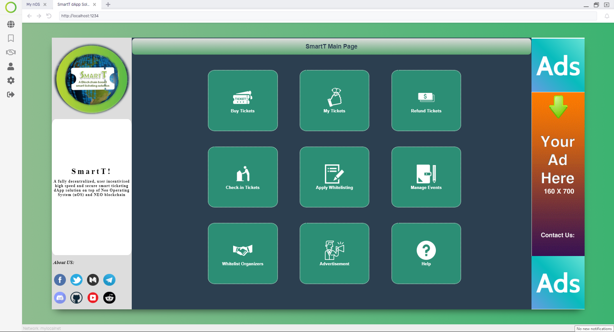

<p align="center">
   
</p>

<h1 align="center">SmartT</h1>

<p align="center">
  SmartT is a smart ticket  management dApp solution<strong>dApp</strong> on the <strong>nOS</strong> platform
</p>

<p align="center">
   
</p>

## Introduction of SmartT:
SmartT (Smart tickets) is a fully decentralized, user incentivised, fast, scalable, and secure smart ticket management dApp solution. The smart contract of SmartT is build on top on NEO blockchain. It is using the powerfull services of nOS (Neo Operating System) and we used MCT (Master Contract Token) as utility token for SmartT dApp. The SmartT mainly focusing on the biggest problems of existing centralized ticketing industry:

<li> Centralized ticket management architecture </li>
<li> High service charges </li>
<li> Involement of third parties</li>
<li> Overpriced tickets and frauds</li>
<li> No rewards for tickets users or organizers</li>
<li> Transcation speed issues</li>
  
  
## Key Features of SmartT:
<strong>1. Smart Earning with SmartT:</strong> One of the key feature of SmartT is Smart Earning. The users (ticket users and event organizers) of SmartT dApp can earn incentives/rewards on monthly/weekly basis by using our <strong>Proof-of-Participation (PoP)</strong> mechanism. The users of SmartT will get equal share of MCT tokens which earned from SmartT's Ads revenue mechanism. Around 70% share of advertisements will distributed among the SmartT users.

<strong>2. Eliminate Third Parties and Almost "Zero Transaction Fee":</strong> Our state-of-art Smart Contract code enables a fully decentralized smart ticketings solution which eliminates the involvments of intermediary service providers and so called centralized ticket management systems. These third parties also charging rediculous fees for processing or purchasing tickets (for example: credit card service charges). SmartT enables peer-to-peer interaction between event organisers and ticket users. SmartT dApp will also eliminates  unneccessary charges which is impossing by these intermediaries. Finally, thanks to NEO blockchain service which make it possible for SmartT dApp to process tickets on blockchain with almost <strong>"Zero Transaction Fee."</strong>

<strong>3. Prevent Overpriced tickets & frauds:</strong> In current event industry it is common that sometimes users cannot buy tickets of a popular event on primary market, it is because of all sold-out tickets. This may happens sometimes only because of scalpers, who resale tickets in black market and over charging the price from users. Our SmartT dApp also prevent such type fraudulent activities by using immutable Smart tickets with unique identification system on NEO blockchain.


<strong>4. Smart Speed of SmartT:</strong> The total credit of transaction processing speed goes to NEO blockchain. Becuase of 10000 TPS, the performance of SmartT dApp is incredible and the transaction confirmation speed is near seconds. The zero transaction cost and TPS speed of NEO is significantly make our SmartT dApp more efficient compare to similar dApp solutions on Ethereum and other existing plateforms.

<strong>5. Scalability of SmartT:</strong> The current centralized ticket management platforms will receive heavy traffic on ticket release date. The power services of nOS (Neo Operating System) make it possible for us to executes any decentralized application locally without worring about centralized servers.  Our SmartT dApp will work in complete decentralized and distributed manner which dispersing the concept of centralized servers, and avoiding potential crashes and allowing SmartT users to buy tickets simultaneously. Therefore, we claim that our proposed SmartT dApp ticket management solution is completely scalable. 
            
## MCT tokens requirement for SmartT:
In order to use our SmartT dApp you must should have some MCT tokens into your wallet. For testing on nOSNet, we can send MCT tokens into your wallet. Please join our discord channel: https://discord.gg/6dZDspu

## Setup
```bash
$ git clone https://github.com/syedasifraza/smartT-dApp.git
$ cd smartT-dApp
$ rm yarn.lock
$ yarn install
$ yarn start
```

## How to Use SmartT:

We divided our SmartT dApp mainly for three users:

<strong>1. Event Organizers:</strong> Those who wants to arrange any type of events.
 
<strong>2. Ticket Users:</strong> Those who wants to buy tickets directly from event organizers by using our SmartT dApp. The users of SmartT will be equally incentivized with 50% share of advertisements.

<strong>3. Advertiser:</strong> An organization, company or an individual who want to advertise their products by using our dApp

The <strong> Buy Tickets, My Tickets, Refund Tickets and Checkin Tickets </strong> options belong to tickets users. By using these options a ticket user can perform all tickets related operations.

The <strong> Apply Whitelisting and Manage Events</strong> options on main page of SmartT is belong to event organizers. Before arranging any event, an organizer require to apply for a whitelisting process. Once our team approve the organizer then he/she can create events, claim income, verify the tickets, etc.

The <strong> Advertisements</strong> options belongs to advertisers. They can place their advertisements in our SmartT dApp. The advertisements areas defined by SmartT dApp team. SmartT uses IPFS technology for storing advertisements files, but the important information related to advertisements is placed on NEO blockchain.

The <strong>Whitelist Organizers</strong> options belongs to SmartT dApp owner. Once the event organizers apply for whitelisting then dApp team/owner will approve or disapprove Organizers by using this option.

